# Lesson 03: Client-side data processing and UI enhancements

## Overview

In previous modules, we used an asynchronous HTTP request to load our GeoJSON data into the script at runtime. Within this lesson, we consider a technique for making multiple asynchronous HTTP requests to load geometry and attribute data into the map script as separate requests (i.e., different files).

Once we do this, we use a nested looping structure to join attribute data to geometries within the client's browser to create a choropleth map. We then build an HTML standards-compliant UI slider element allowing the user to sequence through temporal data attributes and update the thematic map.

## Table of Contents

<!-- TOC -->

- [Lesson 03: Client-side data processing and UI enhancements](#lesson-03-client-side-data-processing-and-ui-enhancements)
  - [Overview](#overview)
  - [Table of Contents](#table-of-contents)
  - [User Interaction II](#user-interaction-ii)
  - [Lesson objective](#lesson-objective)
    - [Working files](#working-files)
  - [Load multiple datasets and join by attribute](#load-multiple-datasets-and-join-by-attribute)
    - [Loading data into the DOM](#loading-data-into-the-dom)
    - [Processing data client-side: binding attribute data to geometries](#processing-data-client-side-binding-attribute-data-to-geometries)
  - [Classifying the data and mapping to colors](#classifying-the-data-and-mapping-to-colors)
    - [Using Chroma.js for data classification and color mapping](#using-chromajs-for-data-classification-and-color-mapping)
  - [Updating the choropleth map](#updating-the-choropleth-map)
  - [Drawing the legend & slider](#drawing-the-legend--slider)
    - [Adding a slider UI to our map](#adding-a-slider-ui-to-our-map)
  - [Function design](#function-design)
  - [Visual design of the page and map](#visual-design-of-the-page-and-map)
  - [Addendum I: Quick CSS for full-screen maps](#addendum-i-quick-css-for-full-screen-maps)
    - [Positioning map elements with CSS](#positioning-map-elements-with-css)
    - [Positioning map elements with Leaflet](#positioning-map-elements-with-leaflet)

<!-- /TOC -->

## User Interaction II

Begin by reading [Chapter Three of _The Shape of Design_](https://shapeofdesignbook.com/chapters/03-improvisation-and-limitations/), "Improvisation and Limitations." Limitations in creative work exist everywhere; the medium imposes some restrictions while others can be self-imposed. Mapmakers have historically had the limitation of scale and have developed ingenious techniques to show an incredible density of information in a small area. The slippy map and its ability to toggle layers on and off have freed mappers from limitations of scale. However, we all have seen slippy maps where no one map state or view is compelling.

In recent years, [monochromatic mapping](https://somethingaboutmaps.wordpress.com/monocarto-2019-winners/) has gained popularity among cartographers because self-initiated limitations force one to develop new techniques by improvising with their toolkit. One learns how to vary symbol styles, e.g., line widths and patterns, in more subtle ways when altering color is not available.

As you move forward designing maps and user interfaces, reflect on the value of imposing limitations in your creative development. When you're looking at an empty browser or code editor, and your Muse hasn't arrived, self-initiated limitations can propel you forward. Use only one font, three colors, and a few interaction states/events (e.g., modal on or off comprises two interaction states). While these limitations simplify your design choices, you might discover new ways of expressing your content.

## Lesson objective

Proceed through the lesson before moving on the assignment and follow the guided tutorial to complete the demonstration map. Save your work and commit changes. We will display time-series data on a single map. Our final map will look similar to and behave like this:

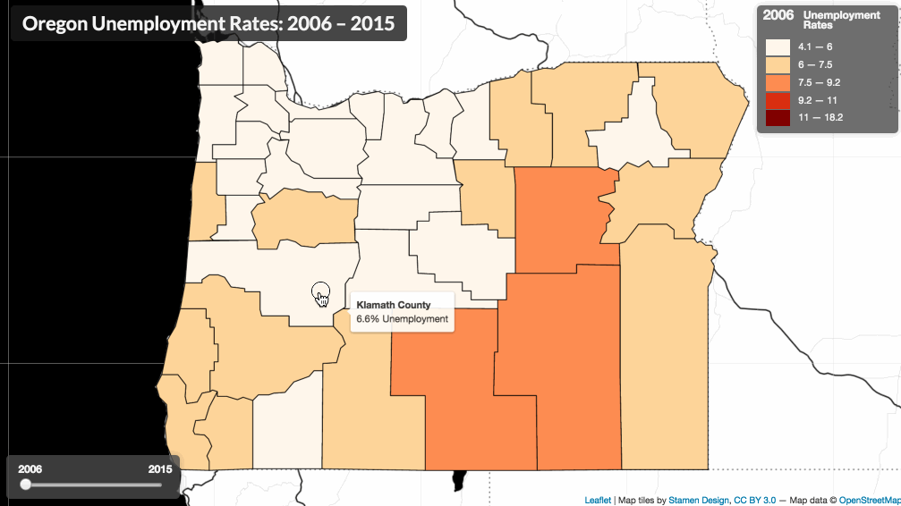  
_Final map made within Lesson 03_

The second part of the [assignment](assignment/) instructs you to make a similar map with a different geography and challenges.

### Working files

To follow along with this lesson, you should use the _index.html_ file located in the _module-03/lesson/_ directory. Note that this working directory includes two files: a data file named _or-unemployment-rates.csv_ and a file containing GeoJSON data named _or-counties.json_.

Open the template _lesson/index.html_ file starter file in your text editor, examine the document, and open the file in your web browser using a local server. You'll see that the geometries of Oregon counties are drawn to a Leaflet map with a black and white base map for reference.

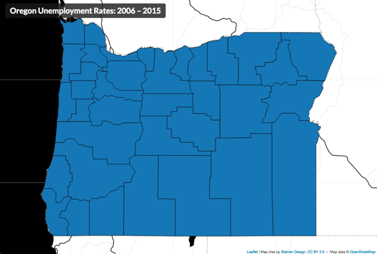  
_Starter map used in Lesson 03._

The _index.html_ file includes a full-screen template using CSS, HTML, and JavaScript. Unlike previous lessons, we are not relying on Bootstrap to help with the layout – we're going to 'roll our own' and try to make a page that accommodates both small and large screens.

The page is ready for your additions. If you want to learn more about how we arrived at this design, continue in our below Addendum. After digging through this section, you may appreciate the value of using a CSS framework like Bootstrap.

Read the code and understand how the script is currently working. After the UI button for the page info and modal are set, a Leaflet map is created, and the Stamen tiles added to the map:

- Make an AJAX request with `fetch()` and load the _or-counties.json_ file.
- When the file is loaded and available as the parameter `counties`, the script calls the `processData()` function, passing `counties` as an argument.
- The `processData()` function calls the `drawMap()` function, passing `counties` as an argument.
- The `drawMap()` function uses the GeoJSON data to create a L.GeoJson object with basic styles, adds it to the map, and then fits the map view to the extent of the layer.

You'll also notice that some empty functions have been declared (but not called).

If you examine the _or-counties.json_ file, you'll notice the only feature attributes are state and county FIPS codes. There is no exciting data with which to create a thematic map. However, the _or-unemployment-rates.csv_ file does contain such data as well as state and county FIPS codes.

Our goal moving forward is to load this CSV file, join the attribute data to the GeoJSON features (using the shared FIPS codes), and then create our choropleth map. We'll then add the UI slider element, allowing the user to update the map dynamically and sequence through the yearly timestamps.

Let's get started!

## Load multiple datasets and join by attribute

In previous modules, we used AJAX to load an external file containing GeoJSON data, which provided both the geometry information for drawing our SVG elements on the map (e.g., Kentucky counties) and the data attribute data (e.g., vacant housing rates for each county).

This module introduces the idea of keeping our geometry data and data attribute information in separate files and then using multiple AJAX requests to load these files independently. One reason for doing this is that storing information within a comma-separated values (CSV) file format is notably concise. Especially when you have many data attributes for each mapped unit (i.e., each county), the overall file sizes of keeping that data in CSV files are smaller than encoding within a GeoJSON file.

We introduce the process of programmatically joining data attributes with geometries, a "binding" process that has utility both in front-end client-side mapping (like we're doing), but also for pre-processing data files before they're using in a web mapping project. This technique is also applicable to when you stream live data into your map from a web resource and need to link the new data to geometries you've already drawn on the map.

### Loading data into the DOM

The first step is to load our GeoJSON data using `fetch()`. Remember that this call returns a [promise](https://www.freecodecamp.org/news/javascript-promises-explained/) (a condition in JavaScript that will eventually be fulfilled or rejected). Immediately after the fetch call, we add a `.then()` method to handle the response when it eventually arrives.

```javascript
fetch("data/or-counties.json")
  .then(function (response) {
    console.log(response);
    return response.json();
  })
  .then(function (counties) {
    console.log(counties);
    // We now have the or-counties.json file
  });
```

The use of `.then()` methods is called _chaining_. _Promise chaining_ is a technique that allows us to chain multiple asynchronous operations together and make them run synchronously. A `.then()` method's code block will only run after the upstream promise is fulfilled or rejected. But, code outside of this chain will run regardless of the promise state.

To deal with potential errors with responses, we need to "catch" the error. Let's chain another method onto it called `.catch()`, which executes an anonymous function if the AJAX request and parsing of the file were unsuccessful. Its implementation looks like this:

```javascript
fetch("data/or-counties.json")
  .then(function (response) {
    console.log(response);
    return response.json();
  })
  .then(function (counties) {
    console.log(counties);
  })
  .catch(function (error) {
    console.log(`Ruh roh! An error has occurred`, error);
  });
```

Because we are hosting our data, we shouldn't expect many errors to occur. One quick side note before we continue. After some experience with this technique, you may find Console errors with _index.html_ line numbers pointing to this the `.catch()` block. Because we will start our map from within a `.then()` block, an error later in the script might trace back to this `.catch()` block. Make sure to look at the error message in detail, noting all line numbers, to determine where the error actually started.

Okay, back to the data loading. Assuming that we successfully loaded and parsed our `or-counties.json` file, within the callback function, we want to issue our next AJAX request, this time loading an external CSV file named `or-unemployment-rates.csv`.

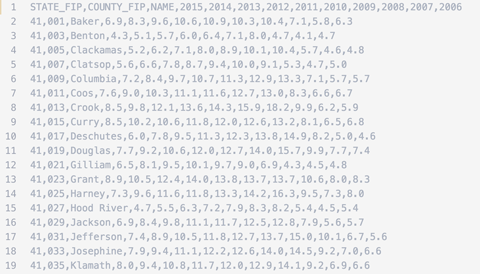  
_CSV data of OR unemployment rates over time._

We can also open it using a spreadsheet/database program such as OpenOffice Calc or Microsoft Excel. However, be careful when using data containing Federal Information Processing Standards (FIPS) codes, such as we're doing for state and county identifiers. These programs will sometimes inadvertently strip the leading zeros from the identifiers and cause potential problems later in the script (e.g., Alabama's State FIP will be converted from 01 to 1). **It's often a good practice to keep values quoted as text strings within a CSV file for this reason.**

Thinking ahead for a moment, once we load the CSV data into our script, we ideally want it converted into a JSON format (i.e., an object consisting of key/value properties) within the user's client (browser). We want the first row of the CSV, the "header" row, to be the key names for this object, and the values for each row to be the values associated with those key names. When building a CSV file for web mapping, rows should contain the features and columns should be the data attributes for those features.

Unfortunately, the Fetch API doesn't support CSV formats. We can easily load the CSV file as text, but then we would need to write our JavaScript to "parse" the data ourselves into our desired JSON format. While this could be a fun programming exercise, we want to get on with our mapping process. What's our solution then? Let's consider using an additional JavaScript library to do this for us!

[Papa Parse](http://papaparse.com/) bills itself as a "powerful, in-browser CSV parser for big boys and girls." Now that's the kind of confidence we want to see in a JavaScript library, right? Seriously, though, it's a sound library for this task.

To make use of it in our script, we need to load it, again, like we are loading our Leaflet JS library. Within the head of our document, we'll make use of the `scr`attribute of a `script` tag, referencing Papa Parse's content delivery network (CDN) URL:

```html
<script
  src="https://cdnjs.cloudflare.com/ajax/libs/PapaParse/5.3.1/papaparse.min.js"
  integrity="sha512-EbdJQSugx0nVWrtyK3JdQQ/03mS3Q1UiAhRtErbwl1YL/+e2hZdlIcSURxxh7WXHTzn83sjlh2rysACoJGfb6g=="
  crossorigin="anonymous"
  referrerpolicy="no-referrer"
></script>
```

Of course, we need to consult some of this [library's documentation](http://papaparse.com/docs) to see how to use this library (i.e., what methods are now available to us, what arguments they require, and what options are available). The following configuration appears to do the trick, and we can `console.log()` the parameter `data` that's passed within `Papa.parse()` method's callback function. Note that within that callback function, our GeoJSON `counties` data is also available.

```javascript
fetch("data/or-counties.json")
  .then(function (response) {
    console.log(response);
    return response.json();
  })
  .then(function (counties) {
    console.log(counties);

    Papa.parse("data/or-unemployment-rates.csv", {
      download: true,
      header: true,
      complete: function (data) {
        // data is accessible to us here
        console.log("data: ", data);

        // note that counties is also accessible here!
        console.log("counties: ", counties);
      },
    }); // end of Papa.parse()
  })
  .catch(function (error) {
    console.log(`Ruh roh! An error has occurred`, error);
  });
```

Examining the output within the Console, let's understand the data structure returned by the `Papa.parse()` method. We first see that the library encoded 52 rows of data as a JSON object and assigned it to a property named `data`. Papa Parse has successfully converted our CSV tabular data into a JSON object. Furthermore, we should note that it has also encoded the numerical data values for each year as string types (we should remember this later, when we're using these data values).

The following animation shows us logging both the `counties` and the `data` to the Console and inspecting the output.

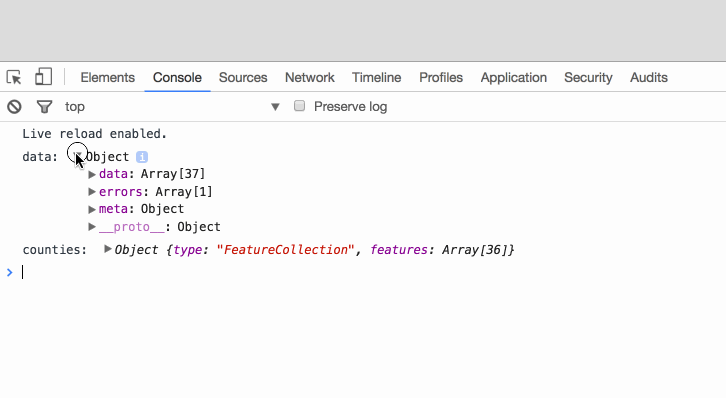  
_CSV data has been parsed into a JSON object._

Great, now that we have our two data objects in the same place (our GeoJSON geometry data and the CSV attribute data converted to an array of objects), let's figure out a way to attach the attribute data from the CSV file to the GeoJSON geometry data. To do so, let's first get them out of these asynchronous callback functions and into a new function for processing. That's easy enough: we'll call a function and pass them as arguments:

```javascript
Papa.parse("data/or-unemployment-rates.csv", {
  download: true,
  header: true,
  complete: function (data) {
    // Create function to join data and counties
    processData(counties, data);
  },
});
```

Next, let's create that function and write the code for client-side data processing.

### Processing data client-side: binding attribute data to geometries

We ended the previous section by calling a function we named `processData()` and passed two JS objects &ndash; our CSV attribute data and our GeoJSON geometry data &ndash; as arguments. As we know by now, if we call a function, such a function must exist! So we'll now create that function and define it with the necessary parameters to accept those arguments (we'll just retain the same names, `counties` and `data`):

```javascript
function processData(counties, data) {
  // code goes here
}
```

Now we're going to build a nested looping structure. That is, we're going to loop through one of the JSON objects properties, and for each time we do that, we're going to loop through all the properties of the second object. A nested looping structure is a fairly common technique in programming, but a little complicated to get your head around the first time, so read carefully and study the code and output you're writing.

#### Revisiting ways to loop over data

In most previous lessons, we have favored the classic three-statement `for` loop. As shown below, we are looping over an array of letters (the "outer" loop) and numbers (the "inner" loop) and Console logging their values. The first statement in the `for` loop runs before the first iteration, the second statement runs before each iteration and, if true, will continue looping, and third statement runs after each iteration. This benefit of using this `for` loop is that it has been around since the beginning of JavaScript and used by all browsers. The downside is that it's a rather verbose syntax, i.e., having to use bracket notation (and two variables) to access an array element.

```javascript
const letters = ["a", "b", "c", "d", "e"];
const numbers = [1, 2, 3, 4, 5];

for (let i = 0; i < letters.length; i++) {
  for (let j = 0; j < numbers.length; j++) {
    console.log(letters[i], numbers[j]); // what are these outputs?
  }
}
```

Note that we are using the `let` keyword to declare the variables `i` and `j` within the loop. This is because the variables are scoped to the loop. If you `console.log` these variables outside of the loop, you'll see that they are undefined – ready to be used again later in the script.

Now let's compare the [`for...of` statment](https://developer.mozilla.org/en-US/docs/Web/JavaScript/Reference/Statements/for...of) looping structure. Instead of returning the index value of the element, the iterating variable returns the element. This loop makes a more compact syntax. However, we no longer have default access to the index value of the array element, which can be a downside.

```javascript
for (let i of letters) {
  for (let j of numbers) {
    console.log(i, j); // what are these outputs?
  }
}
```

The last example of creating a loop is the [`.forEach()` method](https://developer.mozilla.org/en-US/docs/Web/JavaScript/Reference/Global_Objects/Array/forEach), which executes a function on each element in the array. This automatically creates a unique function scope for each element in the array. The function takes one required argument, the current element in the array. A second optional argument is the index of the current element.

It is commonly used with the arrow function notation `=>` and can be read as "pass this element into this function block." The advantage is a clean, simple syntax (if you have a little experience with [arrow functions](https://www.w3schools.com/js/js_arrow_function.asp)) and doesn't require declaring variables. However, you cannot break out of a `.forEach()` loop.

```javascript
letters.forEach((i) => {
  numbers.forEach((j) => {
    console.log(i, j); // what are these outputs?
  });
});
```

All three approaches to looping have advantages and show the many ways one can arrive at a solution in programming. We even have more looping options with [`.some()`](https://developer.mozilla.org/en-US/docs/Web/JavaScript/Reference/Global_Objects/Array/some) and [`.every()`](https://developer.mozilla.org/en-US/docs/Web/JavaScript/Reference/Global_Objects/Array/every) methods. Which is best, you ask? The one you like. While all of these approaches have been adopted by modern browsers, you should check [Can I use](https://caniuse.com/) for more exotic browsers. We'll use the `for...of` looping structure.

#### Binding the attribute data

Now examine the output logged to the Console. Within the inner loop, we can compare each of the first array's values with each of the second array's values.

In other words, as the two loops iterate through their values, we're able to, at some point, have every combination of values from the two arrays in the same place at the same time (in this case, logging them to Console).

How then do we apply this concept to our two JSON structures? Remember, our goal here is to bind the data within the CSV file with its associated geometries in the GeoJSON file. For this to happen, the elements within the two JSON objects **must share a unique identifier between them**. Without this, we can not bind the data and geometries.

Fortunately, these two data objects do share a unique identifier, namely the state FIPS (Federal Information Processing Standard) codes. Within the GeoJSON, these were encoded as values for a property named "COUNTYFP." Within the CSV file, the header row value of "COUNTY_FIP" designates the county's FIP id.

So then, our pseudo-code for binding these data is as follows:

- loop through the GeoJSON data's features
- for each state, loop through the CSV data
- if the FIPS code for the state matches that of the CSV data, add the CSV data to that GeoJSON feature's properties

First, let's review how our data are structured. Both are JSON objects. The `counties` variable has a key called `features` that contains the array of county features, including a key called `properties` with a field called `COUNTYFP`. The variable `data` has a key called `data` that contains an array of county unemployment rates by year and field called `COUNTY_FIP`.

Start with the basic looping structure and log the values to the Console to understand how the structure is accessing our data values. Again, we want the GeoJSON's `COUNTYFP` to match up with the CSV data's `COUNTY_FIP`.

```javascript
// loop through all the counties
for (let i of counties.features) {
  // for each of the CSV data rows
  for (let j of data.data) {
    // if the county fips code and data fips code match
    if (i.properties.COUNTYFP === j.COUNTY_FIP) {
      // console.log the values
      console.log("county fip: ", i.properties.COUNTYFP);
      console.log("data fip: ", j.COUNTY_FIP);
    }
  }
}
```

We can examine the FIPs codes within both the `counties` and the `data` objects by logging them to the Console.

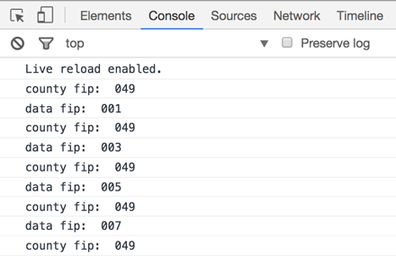  
_Nested looping structure through the counties GeoJSON and the CSV attribute data._

Within the inner loop, we know that eventually each GeoJSON feature will be associated with its corresponding CSV (now JSON) property, and we can use a conditional statement within that inner loop to determine when this happens. If there is a match, we can replace the GeoJSON's properties with those of the CSV file.

```javascript
// Replace the county properties with the CSV data
// loop through all the counties
for (let i of counties.features) {

    // for each of the CSV data rows
    for (let j of data.data) {

        // if the county fips code and data fips code match
        if (i.properties.COUNTYFP === j.COUNTY_FIP) {

          // re-assign the data for that county as the county's props
          i.properties = j;

        // no need to keep looping, break from inner loop
        break;
  }
}
```

We'll replace the GeoJSON's original properties here with all the CSV data since there's no other information in the GeoJSON beyond the FIP we wish to retain. However, if there were properties, we'd have to figure out a way to append the CSV data to the GeoJSON's properties.

Let's give an example. To be clear, this change would preserve properties from both datasets, but it alters how we would access these later in the script. The lesson documentation and video will continue with the simpler approach of replacing the GeoJSON's properties with the CSV data.

We could add another object property `unemploymentData` and store the new data as its value:

```javascript
// Add CSV data to a new property in the county layer
// if the county fips code and data fips code match
if (i.properties.COUNTYFP === j.COUNTY_FIP) {

  // Add a new property to hold the unemployment rates
  i.properties.unemploymentData = j;

  // no need to keep looping, break from inner loop
  break;
}
```

Finally, since we know there should only be one match for each county, once we've made a match, we can use a `break` statement to break out of the inner loop and continue with the outer loop (this will help speed up the processing).

Once this nested looping structure is complete, our `counties` object should contain the data from the CSV within its properties. A trusty `console.log()` statement is used to verify this.

Log to console the value of `counties` after the looping structure to verify that the CSV data has been bound to the geometries' properties.

```javascript
} // end of outer loop

console.log('after: ', counties);
```

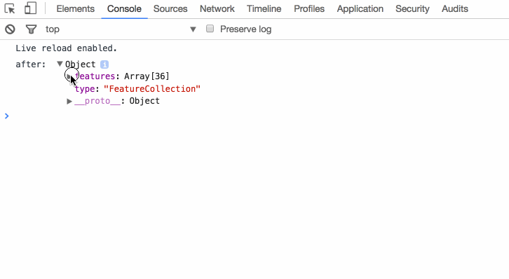  
_CSV data have now been bound to the GeoJSON features._

We've now attached our attribute data to the GeoJSON data, and we're finally ready to create our map!

Of course, you may be thinking, "that was a lot of scripting work just to do what I could have first done with a table join in QGIS!" And you're correct.

But beyond JavaScript practice, this technique proves useful in a variety of scenarios when either your user may choose to load another data set from an external resource, upload their data for mapping, or when your map pulls in data automatically from an external resource or API.

Also, once a newer dataset is released, you only need to add one more column to the CSV file, and you're ready to go!

## Classifying the data and mapping to colors

One notable difference between this map and the interactive choropleth map we built-in Module 02 is how (and how many times) we classify the data within the script. As we know, classification methods are often a dicey business and drastically impact the message of the map.

In Module 02, we reclassified the data each time the user updated the map with a new data attribute (through the dropdown menu). This application makes sense, as we don't want to use the same class breaks for symbolizing vacant housing as we do for units with a mortgage (these two datasets have a different range and distribution of values).

However, the objective of the map we're building in Module 03 is to compare data attributes across time by dragging a slider widget, i.e., to visualize spatiotemporal patterns. In this case, we want to keep the data classification breaks constant to more easily compare map counties year to year and include the entire range of data. We'll, therefore, need to deviate from the Module 02 solution to **create the classification breaks one time within the script using the entire range of data values**.

Therefore, before we call the function to draw the map, within the `processData()` function, we can employ another nested looping structure to push all these values into an array (each timestamp attribute value for each county).

The following code snippet:

- creates an empty array to store all the data values
- iterates through all the counties
- iterates through all the props of each county
- conditionally tests each attribute to verify it's a timestamp value (and not one of our FIPS codes or the name of the county)
- pushes that value into an array, converting it to a number

```javascript
// Accessing data values from county properties
// empty array to store all the data values
const rates = [];

// iterate through all the counties
counties.features.forEach(function (county) {
  // iterate through all the props of each county
  for (const prop in county.properties) {
    // if the attribute is a number and not one of the fips codes or name
    if (prop != "COUNTY_FIP" && prop != "STATE_FIP" && prop != "NAME") {
      // push that attribute value into the array
      rates.push(Number(county.properties[prop]));
    }
  }
});

// verify the result!
console.log(rates);
```

If you saved the rates in a different property, i.e., you didn't overwrite the properties in the counties geometry object, you would need to adjust the code accordingly. For example, if you saved the rates in a new property called `unemploymentData`, you would need to access the rates like this:

```javascript
// Accessing data values from new county property
// empty array to store all the data values
const rates = [];

// iterate through all the counties
counties.features.forEach(function (county) {
  // iterate through all the props of each county
  for (const prop in county.properties.unemploymentData) {
    // if the attribute is a number and not one of the fips codes or name
    if (prop != "COUNTY_FIP" && prop != "STATE_FIP" && prop != "NAME") {
      // push that attribute value into the array
      rates.push(Number(county.properties.unemploymentData[prop]));
    }
  }
});

// verify the result!
console.log(rates);
```

How you combine data is up to you and depends on your application. The key is to understand how to access the data through dot and bracket notation.

We should now have an array containing **all data values** for all geographic units for all years. We can now use this array to classify the data. Let's now discover a new library that can both classify our data and provide color values for each class.

### Using Chroma.js for data classification and color mapping

Next, we derive the class breaks from this range of data and apply those same breaks universally across the data attributes as they change (i.e., the yearly timestamps). Note that because the _or-unemployment-rates.csv data_ is already a rate (a percentage), there's no need to normalize these data computationally within our JavaScript.

In previous modules, we used the Simple Statistics JS library to do some heavy lifting for us when calculating class breaks. Then we wrote our custom color function to return a specific color given a particular attribute value.

In this lesson, we introduce yet another JS library we can use: [Chroma.js](http://gka.github.io/chroma.js/#chroma-scale), a "small-ish JavaScript library (12kB) for dealing with colors!" You should follow that link and read through some of the documentation and examples. While most of it just deals with methods to return various colors, there are also some helper methods that [computes class breaks](http://gka.github.io/chroma.js/#chroma-limits), [map numeric values to a color](http://gka.github.io/chroma.js/#chroma-scale), and returning [distinct sets of colors](http://gka.github.io/chroma.js/#scale-classes) (useful for classed choropleth maps!).

To use the library, we need to load it into our script:

```js
<script
  src="https://cdnjs.cloudflare.com/ajax/libs/chroma-js/2.1.2/chroma.min.js"
  integrity="sha512-8TVPS0EFkkmtT6yPb5K4csnSt3tjbKRrs0F8gvTNKv2OxOcwDO7+Klkz86gMVrzfqtZos5N2a+k+r9D+hlccmQ=="
  crossorigin="anonymous"
  referrerpolicy="no-referrer"
></script>
```

After we've built the giant array of all the data values (and verified no FIPS codes snuck in there!), we can write the following two statements that do a lot of work for us:

- First, determine class breaks (here using our `rates` array, a quantile method, and 5 classes)
- Create a color generator function using ColorBrewer's Orange-Red color scheme that returns a color based on where an input value fits within the 5 classes of colors using our break values. The colors along the color gradient are interpolated using the Lab color space. We assign this function to the variable name `colorize`.

```JavaScript
// create class breaks
var breaks = chroma.limits(rates, 'q', 5);

// create color generator function
var colorize = chroma.scale(chroma.brewer.OrRd)
                .classes(breaks)
                .mode('lab');
```

This is subtle but important. What data type is `colorize`? If log it to console, we see that it is a function:

```JavaScript
console.log(colorize) // function (a){var b;return b=s(u(a)),m&&b[m]?b[m]():b}
```

You may need to go back to MAP672 to read about functions, but if you recall, there are two types of functions: **function declarations** and **function expressions**. We've mainly been writing function declarations, but in this case, `colorize` is written as a function expression. This means 1.) it must be written above where it is used in the script (is not hoisted), and 2.) can be passed arguments implicitly.

For example, try the following code:

```javascript
var color = colorize(20);
console.log(color); // a {_rgb: Array[4]}
```

The return value is an RGB value (a color value!) we can use within our script. Elements `0` through `2` of the array are the red, green, and blue values, respectively. The last element is the opacity value (1 being 100% opacity).

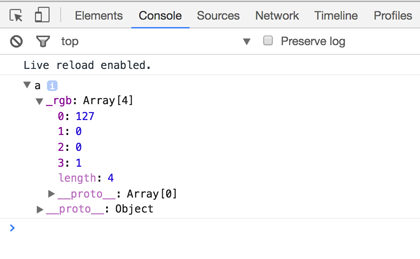  
_Output of a single value passed to colorize function expression._

We're using these methods of Chroma.js to return a color, rather than building our own `getColor()` function (if you peek beneath the hood, Chroma.js is doing something similar).

We're now ready to create the choropleth map. Call the `drawMap()` function at the bottom of the `processData()` function, passing both the `counties` GeoJSON object and the `colorize` function as arguments. Yes, we can pass functions as arguments to other functions!

## Updating the choropleth map

We're using the similar logic we employed with Lesson 02 within this map: 1.) first draw the map using one function, and 2.) update the map with the colors using a second function. This way, once we build the UI slider widget, we can repeatedly call the `updateMap()` function to re-colorize the map.

After the GeoJSON data is converted to the L.GeoJson object and drawn to the map, call the function to update the map. Pass the reference to the L.GeoJson object (`dataLayer`) and the `colorize` function (note that `colorize` has simply been passed through the `drawMap()` function and not used within it).

We also want the `updateMap()` function to initially draw the map using a specific timestamp, so we can hardcode the value for the first year and pass that as an argument as well (we're trying to avoid using global variables now within this lesson script):

```javascript
updateMap(dataLayer, colorize, "2001");
```

Next, update the parameters and write code within the `updateMap()` function to loop through the counties (using the Leaflet `.eachLayer()` method) and apply a `colorFill` value, using the `colorize` function we created using Chorma.js. You'll want to be sure you're using the numeric value to do so. This example assumes there is a `currentYear` parameter within the function that references the value '2006' passed from the caller.

```javascript
fillColor: colorize(Number(props[currentYear]));
```

When this is complete you should have a working map that looks something like this (eek, yes, a choropleth projected in Web Mercator ... LOL kittens are dying):

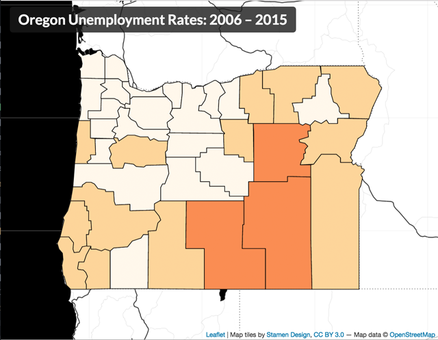  
_Map colored as a classed choropleth._

## Drawing the legend & slider

Next, we'll draw the legend. Remember that because we're setting the classification breaks once for all the timestamps, we only need to call one function (`drawLegend()`) once. We can call this function up in the `processData()` function (where we call `drawMap()`), and pass `breaks` and `colorize` as arguments.

Building the legend, like all of web map design, involves HTML, CSS, and JavaScript. We won't write the actual HTML markup ourselves into the document, but again we'll allow Leaflet's JS to create the division element (with a class attribute value of `legend` for styling with CSS) and add it to the map:

- create a Leaflet control for the legend
- when the control is added to the map
- create a new division element with class of 'legend'
- return the new element
- add the legend control to the map

```javascript
// create a Leaflet control for the legend
const legendControl = L.control({
  position: "topright",
});

// when the control is added to the map
legendControl.onAdd = function (map) {
  // create a new division element with class of 'legend' and return
  const legend = L.DomUtil.create("div", "legend");
  return legend;
};

// add the legend control to the map
legendControl.addTo(map);
```

We can now select that element with JS using the class attribute of `legend` and loop through our break values, creating new elements. This solution is different than the legend solutions previously proposed and uses an unordered list and list item for each class range:

- select the newly created legend, select and populate the heading, creating an unordered list for the class ranges and store as a reference to a variable
- loop through the break values
- access the color for each class range
- build a list item with color block and values
- append the list item to the list
- close the unordered list

```javascript
// select div and create legend title
const legend = document.querySelector(".legend");
legend.innerHTML = "<h3><span>2001</span> Unemployment Rates</h3><ul>";

// loop through the break values
for (let i = 0; i < breaks.length - 1; i++) {
  // determine color value
  const color = colorize(breaks[i], breaks);

  // create legend item
  const classRange = `<li><span style="background:${color}"></span>
        ${breaks[i].toLocaleString()}% &mdash;
        ${breaks[i + 1].toLocaleString()}$ </li>`;

  // append to legend unordered list item
  legend.innerHTML += classRange;
}
// close legend unordered list
legend.innerHTML += "</ul>";
```

We've now built the structure for the legend. But it's going to need CSS rules for proper display.

You'll want to experiment with the various CSS property values to achieve your own design. However, for reference we used the following CSS rules for this demonstration (again, these are similar to those already employed in the previous modules, though this time we're selecting the `ul` and `li` elements for styling):

```css
.legend {
  font-family: Lato, sans-serif;
  padding: 6px 8px;
  font-size: 1em;
  background: rgba(75, 75, 75, 0.8);
  color: whitesmoke;
  box-shadow: 0 0 15px rgba(0, 0, 0, 0.2);
  border-radius: 5px;
  width: 160px;
}

.legend h3 {
  font-size: 1.1em;
  font-weight: bold;
  line-height: 1em;
  color: whitesmoke;
  margin: 0;
}

.legend h3 span {
  font-size: 1.3em;
  margin: 0 20px 0 0;
}

.legend ul {
  list-style-type: none;
  padding: 0;
  margin: 12px 4px 0;
}

.legend li {
  list-style-type: none;
  height: 22px;
}

.legend span {
  width: 30px;
  height: 20px;
  float: left;
  margin-right: 10px;
}
```

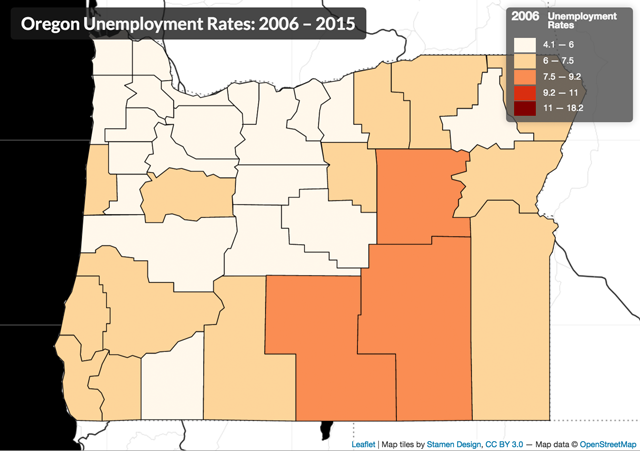  
_Map with legend added._

We now have a basic static choropleth map drawn to the map. Time to add user interaction!

### Adding a slider UI to our map

Once we've drawn the map and initially updated our map with a single year's data, we want to give the user the power to change the map by sequencing through our data attributes (in this case, yearly unemployment rates per county).

This lesson introduces you to another convenient HTML element used to build a slider widget. We use the same HTML element, the `input` element, as we used for the dropdown ([https://developer.mozilla.org/en-US/docs/Web/HTML/Element/Input](https://developer.mozilla.org/en-US/docs/Web/HTML/Element/Input)). Like with the dropdown form element we built in Module 02, we'll create this HTML element within the DOM by directly writing it within the HTML (rather than creating the element dynamically with the JavaScript).

```html
<div id="map"></div>
<div id="ui-controls">
    <input type="range" min="2001" max="2021"
           value="2001" step="1" class="year-slider">
    </input>
</div>
```

We're going to give it a different type attribute value, though, a recent addition to the HTML5 specification known as `range` (see the section under [Sliders](https://developer.mozilla.org/en-US/docs/Web/Guide/HTML/Forms/The_native_form_widgets) here).

We also write several other attributes into the input element when we write it with the HTML. In this example, we're necessarily hard-coding these values in so they correspond with our data. We know, looking at our CSV data, that we want to slide from an initial minimum value of 2001 to a maximum value of 2021. We also know we have data attributes for every year (i.e., whole integer) between these years, so we want the increment level to be one. We encode these values into the input element using the attributes `min`, `max`, `value` (which sets the initial slider widget position when the element loads in the DOM), and `step`.

Note that if our data were, say, decennially census data, we could make the `step` attribute value 10, and the slider would register changes in values of 10 with each step. We want to place this HTML code up within the `<body>` tags, either above or beneath our `<div id="map"></div>` element (since we'll be dynamically placing it on the map, it doesn't matter where in relation to this element the code is written within the HTML).

We'll also give our input element a class named `year-slider` and wrap it within a div element with an id attribute of `ui-controls`. We use these class and id attributes for both styling elements with CSS rules and selecting them with the JavaScript.

Now that we have the HTML in place let's add some CSS rules for styling. In your actual development, the process may be much more iterative, placing HTML elements one at a time and creating the style rule for each.

```css
#ui-controls {
  font-family: Lato, sans-serif;
  width: 176px;
  padding: 8px 25px 8px 15px;
  background: rgba(75, 75, 75, 0.8);
  box-shadow: 0 0 15px rgba(0, 0, 0, 0.2);
  border-radius: 5px;
  color: whitesmoke;
}

#ui-controls .min {
  float: left;
}

#ui-controls .max {
  float: right;
  margin-right: -15px;
}

.year-slider {
  width: 100%;
}

label {
  font-size: 1.1em;
  font-weight: bold;
}
```

Saving and refreshing the page will not display this range slider because it is still stacked beneath the map. Time to write more JavaScript.

We'll encapsulate the JavaScript code we write to create this UI element within a single function. We can name this function `createSliderUI()`.

We'll also need to call this function, obviously, and as usual, we need to think carefully about where we want to call it. What will this function do?

- select the HTML input form we've built
- listen for changes
- call the function to update the map, passing the current value of the range slider to the `updateMap()` function.

We know it's going to call the `updateMap()` function, which currently as we've written it accepts three arguments:

```javascript
function updateMap(dataLayer, colorize, currentYear) {
  // code here
}
```

Therefore, we need the call from the `createSliderUI()` function to pass the three required arguments. Even though we're not using `dataLayer` and `colorize` for the UI slider, we still need to pass these into the function so they can be passed along to the `updateMap()` function (unless they are global variables, which we're trying to avoid).

So we need to call the function where these arguments are available, which is within the `drawMap()` function, after the map has been drawn (and perhaps before we initially call to update the map):

```javascript
createSliderUI(dataLayer, colorize);
```

Now let's write the code within the `createSliderUI()` function.

While we could use CSS absolute positioning to add these elements atop our map, similar to the h1 element, we can also use Leaflet to do this. We used Leaflet's `L.control()` class to create a dynamic legend and add it to the map. This example is similar; however, rather than using Leaflet's methods to create a new DOM element, we're using the statement `L.DomUtil.get("ui-controls")` to select that `<div>` element we just manually wrote into our HTML (storing a reference to it with as `const sliderControl`).

The following code:

- creates a Leaflet control object and store a reference to it in a variable
- when we add this control object to the map,
- selects an existing DOM element with an id of "ui-controls"
- disables scrolling of map while using controls
- disables click events while using controls
- returns the slider from the onAdd method
- add the control object containing our slider element to the map

```javascript
// create Leaflet control for the slider
const sliderControl = L.control({ position: "bottomleft" });

// when added to the map
sliderControl.onAdd = function (map) {
  // select an existing DOM element with an id of "ui-controls"
  const slider = L.DomUtil.get("ui-controls");

  // disable scrolling of map while using controls
  L.DomEvent.disableScrollPropagation(slider);

  // disable click events while using controls
  L.DomEvent.disableClickPropagation(slider);

  // return the slider from the onAdd method
  return slider;
};

// add the control to the map
sliderControl.addTo(map);
```

Note the two curious statements using the `L.DomEvent` class. What are those doing? Without them, the slippy map panning functionality also occurs when the user uses the range slider, annoyingly moving the map when the user drags the slider widget across the track. (This may be undetected because we've disabled dragging and zooming in the initial map creation, but it's good to use for future maps. Uncomment to find out!)

If we now save our file, we'd see we have added our range slider to the map and we can slide the widget along the widget's track.

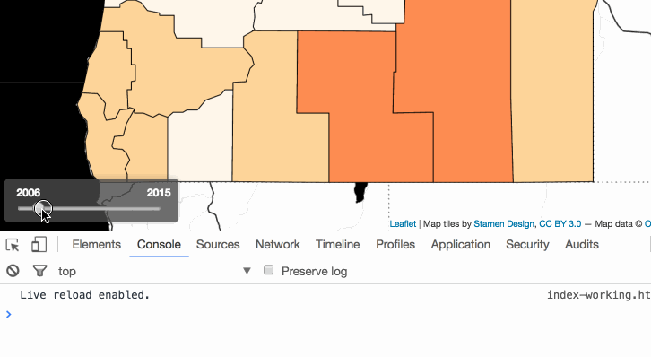  
_Slider widget built from the HTML5 input range._

However, it's currently not updating the map. Like the dropdown menu we built in Module 02, we again need this element to "listen" for user interaction. We need to write this functionality into our code.

Just as we used a method to detect the UI change in a dropdown menu, we'll do the same to recognize when the user is sliding the input range element and call the function to update the map then.

- We'll first select our input element using the class attribute value we gave it: `document.querySelector(".year-slider")`.
- We then add an `addEventListener` with `input` event, which logs the value whenever you change the value of the `<input>` element.
- Upon a change, the callback function is fired where it assigns the variable `currentYear` with `.value` property of the slider.
- We then select the span element nested in the legend > h3 element and replace the HTML with the contents of `currentYear`.
- Once we have this value, we can then assign it to our global variable attribute (i.e., the one we're using to access each of the enumeration unit's currently mapped property values) and make the call to update the map.

```javascript
// select the form element
const slider = document.querySelector(".year-slider");

// listen for changes on input element
slider.addEventListener("input", function (e) {
  // get the value of the selected option
  const currentYear = e.target.value;
  // update the map with current timestamp
  updateMap(dataLayer, colorize, currentYear);
  // update timestamp in legend heading
  document.querySelector(".legend h3 span").innerHTML = currentYear;
});
```

The event listener method remains listening to any changes to the input range slider and continues to update the `attribute` variable's value and update the map with the user drags the widget. Also note that once the user clicks the widget, the user can use arrow keys to move the slider along the track.

This section demonstrated how to implement a slider widget. This specific implementation used the slider to change the currently mapped data attribute to redraw the map. However, a slider widget could be used for various other UI changes, such as adjusting the transparency of a drawn data layer or universally adjusting the size of proportional symbols.

## Function design

Similar to the flow of execution in our previous module, our application uses multiple function calls to draw and then update our map.

1. After successfully loading external data via fetch and promise chaining, our first function call to `processData()` takes two arguments, the geometry layer and the attribute table.
2. After the tables are joined and the classification breaks and color values are determined, the second group of function calls draws the map and the legend. The variable `colorize` is not used in the `drawMap()` function but is passed through the function to be accessible in the `updateMap()` function.
3. The third group of function calls updates the map and draws the slider UI component.
4. Finally, the `createSliderUI()` executes whenever the slider UI changes.

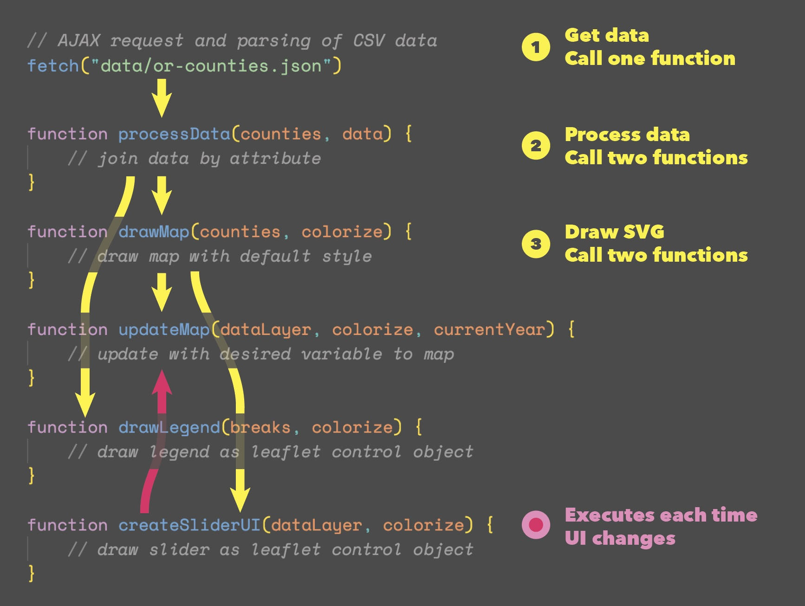  
_Flow of execution of map application_

## Visual design of the page and map

While visual design is one of the more challenging aspects of cartography and information design (as if the programming wasn't challenging enough!), here's a few design principles to keep in mind moving forward:

- Don't add color just for the sake of it. Start with a grayscale design and slowly add color either to encode information or to provide subtle highlights or to establish figure/ground (data/interface) relationships. Use subtle changes in hue (color) and contrast.
- Be consistent in how you design elements. If you've made your h1 and legend with an opaque gray background with rounded edges, make other elements containing UI controls or an information panel consistent with this look and feel.
- Use a single typeface, or at most two different fonts. Try Google's Fonts pairing recommendations for inspiration.
- Consider the visual hierarchy: what is most prominent in the overall design and where is the user's eye drawn first? Is this the entry point you want to explore the map? I.e., if you make the background a bright, highly saturated red color, this may ascend the visual hierarchy. Do you want your user to look at the background first?
- Whitespace (aka empty or negative space) is your friend. The goal of visual design isn't to crowd as much information into a small space as possible. In the web environment, you can use the _padding_ and _margin_ properties of elements' CSS rules to create space around elements affording a better visual balance. Use modal and off-canvas elements to display additional information.
- Show your design to people and elicit design critique. Visual design is an iterative process.

## Addendum I: Quick CSS for full-screen maps

You'll notice that the map in our starter file fills the entire browser window. Let's take a moment to review how we achieve this effect using simple CSS.

When we create (or "instantiate") a new Leaflet map, we use a div container with an `id` attribute of `map` to hold our Leaflet map (e.g., `<div id='map'></div>`). We've also been giving this HTML div element a specific height and width using CSS. We've typically specified the height in pixels using JavaScript to accommodate other elements' height, while the width has either been specified using a percentage or pixels:

```css
#map {
  width: 80%;
  height: 540px; /* Updated in JS */
  margin: 10px auto;
}
```

These techniques are suitable when we want to fix the map to a specific dimension within a page layout. But, suppose we want our map to fill the entire browser window? In fact, let's assume that the map will be primarily used on smaller screens, e.g., mobile devices. The map must expand to the full extent of the screen and place other elements (e.g., map titles, legends, interface controls, side panels) _on top of_ the map itself.

Making a web map go full screen is relatively easy to do with a few changes to the CSS rules. Consider the `div` element that contains our Leaflet map. Modify the CSS property `position` and give it a value of `absolute`. The `position` CSS property is the key to mastering layout using CSS, and you should read more at [www3 Schools](http://www.w3schools.com/css/css_positioning.asp) and [mdn web docs](https://developer.mozilla.org/en-US/docs/Web/CSS/position).

You can apply the following CSS style rule to the `<div id="map"></div>` element to have the Leaflet map fill the entire screen:

```css
#map {
  position: absolute;
  width: 100%;
  top: 0;
  bottom: 0;
}
```

These CSS rules will expand the `div` element holding our Leaflet map to fill the entire viewport of the browser window.

In this case, the value of `absolute` will take our `map` element out of the "normal" flow of elements within the document and position it relative to its (non-static) parent element, which is the body. In other words, it positions the div element with its x/y origin point (its top, left corner pixel) in the upper left of the document body. Using CSS, we then give it a width of 100%, because we want it to fill the entire width of this body element. Two more declarations ensure that the top of the element is zero pixels from the top of the browser window, as well as zero pixels from the bottom.

With the map now taking up the entire viewport, how then do we see other document elements, such as our h1, h2, and map elements? There are two strategies: using CSS absolute position and the [`L.Control()` class](http://leafletjs.com/reference.html#control). We'll use both.

### Positioning map elements with CSS

To achieve this using CSS and absolute positioning, we again change the position of our HTML elements' `position` property from their default value to `absolute` and position the element within the document using either the _top_, _right_, _bottom_, or _left_ properties.

We add our h1 element with the following CSS rules:

```css
h1 {
  position: absolute;
  z-index: 650;
  top: 10px;
  left: 15px;
  padding: 8px 15px;
  margin: 0;
  color: whitesmoke;
  font-size: 1.5em;
  background: rgba(25, 25, 25, 0.8);
  border-radius: 5px;
}
```

As we see in the Leaflet docs, the [Map Panes](http://leafletjs.com/reference.html#map-pane) use z-indexes 200–700. So, if we want our title on top of everything else, we need to give it a `z-index` of a higher value (but perhaps a value that will keep it placed beneath the tooltips and popups).

When laying out elements using absolute position, and there is a problem with the stacking order (i.e., elements on top of each other but shouldn't be), try explicitly setting the z-index values for the elements involved. Also, if it appears that an element isn't being added to the DOM, such as this h1 element in the example, it may be stacked beneath the map and simply not visible.

The next element to style is the map info element. We'll use the following CSS rules:

```css
h2 {
  position: absolute;
  z-index: 650;
  top: 10px;
  left: 15px;
  padding: 8px 15px;
  margin: 0;
  color: whitesmoke;
  font-size: 1.2em;
  text-transform: uppercase;
  background: rgba(25, 25, 25, 0.8);
  border-radius: 5px;
  cursor: pointer;
}

h2:hover {
  background: rgb(72, 72, 72);
}

h2:active {
  background: rgb(228, 175, 0);
}
```

The styles are similar to the `h1` element, but we've added a `cursor: pointer` rule to indicate that the element is clickable. We've also added a `:hover` and `:active` pseudo-class to change the background color of the element when the user hovers over or clicks on it.

You might notice that the `top` and `left` properties are set to the same values as the `h1` element. We want the `h2` element to be positioned with the same left distance, but have an equal vertical spacing from the `h1` element as that element has from the top, e.g., 10px. We need to know the height of the `h1` element. The tiny `buttonUI()` function at the bottom of this example JS does this:

```js
// Top of the script
// get page elements
const modal = document.querySelector("#modal");
const button = document.querySelector("#button");
const h1 = document.querySelector("h1");

// display modal when button is clicked
button.addEventListener("click", function () {
  modal.style.display = "block";
});

// close modal when user clicks anywhere on the page
modal.addEventListener("click", function () {
  modal.style.display = "none";
});

// Set button UI
buttonUI();

// Add event listener for window resize
// When page rotates or is resized, reset page UI
window.addEventListener("resize", buttonUI);

// map stuff

// Function to set button UI
function buttonUI() {
  // set h2 element position relative to h1 element
  // plus 2 * 10px
  button.style.top = h1.offsetHeight + 20 + "px";
}
```

The `buttonUI()`function sets the `top` property of the `h2` element to the `offsetHeight` of the `h1` element plus 20 pixels. The `offsetHeight` property returns the height of the element, including padding, but not the border, margin, or scrollbar (and none are set).

Because we've set this function to run when the page is resized in the statement above, we could compute the position of other elements by adding the appropriate statements inside this function.

Now, let's turn to the modal element, which provides the user with information about the map. We'll use the following CSS rules:

```css
#modal {
  display: none;
  position: absolute;
  z-index: 2000;
  padding: 10px;
  left: 0;
  top: 0;
  width: 100%;
  height: 100%;
  overflow: auto;
  background-color: rgba(0, 0, 0, 0.8);
  color: whitesmoke;
  font-size: 1.5em;
}

#modal .container {
  width: 500px;
  margin: 10px auto;
  padding: 5px 20px;
  position: relative;
  background: rgba(25, 25, 25, 0.8);
  border-radius: 5px;
  border: #0d0000 1px solid;
}

#modal a:link,
#modal a:visited {
  color: rgb(228, 175, 0);
}

#modal a:hover {
  color: rgb(255, 234, 166);
}

#modal div {
  margin: 20px auto;
}

#modal h1 {
  display: none;
}

#modal p {
  font-size: 1.1rem;
  line-height: 1.5rem;
  margin: 5px 0;
}

#modal .footer {
  font-size: 1rem;
  color: rgb(201, 201, 201);
  text-align: center;
}

#modal span {
  position: absolute;
  top: 7px;
  right: 7px;
  cursor: pointer;
}
```

The first property to note is the `display: none` property. This means that the element will not be displayed on the page. We'll use JavaScript to change this property to `block` when the user clicks on the `h2` element. We'll then disable the `modal` element when the user clicks on the modal. The properties of the `modal` element are set to cover the entire page.

However, we should add a visual affordance to indicate that the modal can be closed. The `span` element is positioned absolutely in the upper-right corner, a typical place to put a cancel element. Its `cursor` property is set to `pointer` to indicate that the element is clickable. This element holds a `&times;` character, which is the HTML entity for the multiplication symbol. We'll use this symbol to indicate that the element is a close button.

The `modal` element has a `z-index` of 2000, which is higher than all other elements. It also had a dark, transparent background color. This means that the modal will be displayed on top of all other elements and will be darkened to indicate that it is a modal.

Now, let's look at the HTML for the modal:

```html
<div id="modal">
  <div class="container">
    <span>
      &times;
      <!-- Use an SVG graphic instead of &times; -->
      <!-- <svg
        xmlns="http://www.w3.org/2000/svg"
        width="20"
        height="20"
        viewBox="0 0 24 24"
        fill="none"
        stroke="currentColor"
        stroke-width="2"
        stroke-linecap="round"
        stroke-linejoin="round"
        class="feather feather-x"
        >
        <line x1="18" y1="6" x2="6" y2="18"></line>
        <line x1="6" y1="6" x2="18" y2="18"></line>
    </svg> -->
    </span>
    <h1>Oregon Unemployment Rates: 2001 &ndash; 2021</h1>
    <div class="title">Data sources and methods</div>
    <p>
      County unemployment data acquired from Bureau of Labor Statistics data
      tables for years 2001 - 2021:
      <a href="https://www.bls.gov/lau/tables.htm#mcounty">Link</a>
    </p>
    <p>
      Multiple years were aggregated by county using the county and state FIPS
      codes. Download
      <a href="data/or-unemployment-rates.csv">CSV</a> file.
    </p>
    <div class="footer">New Maps Plus | March, 2023</div>
  </div>
</div>
```

Inside the modal, we have a container element. This element has a `position` property of `relative`. That's important as it allows the `span` element to land in the upper-right corner of the container element and not the entire page. The commented-out `svg` element is an alternative to the `&times;` character. Which do you prefer?

The `h1` element is hidden, but we'll show it when the page is viewed on small screens in portrait mode. We will also adjust the width of the container element to 90% of the screen width. We use CSS `@media` queries to do this:

```css
/* Small devices (portrait phones, 576px and below) */
@media (max-width: 576px) and (orientation: portrait) {
  h1 {
    display: none;
  }

  #modal .container {
    width: 90%;
  }

  #modal h1 {
    display: block;
    position: relative;
    margin: 20px auto;
    padding: 0;
    font-size: 1.6rem;
    top: unset;
    left: unset;
  }
}
```

The page `h1` element is not displayed when the device is less than 576px wide and in portrait mode; but the `#modal h1` is displayed. Because the `#modal h1` inherits properties from the page `h1` we `unset` the `top` and `left` properties.

The last CSS rule to mention is the `box-sizing` property. This property is set to `border-box` for all elements. This means that the `width` and `height` properties will include the padding and border of the element. This is important because we want `#modal .container` element to be exactly 90% of the screen width. If we didn't set the `box-sizing` property, the `width` property would be 90% of the screen width plus the padding and border widths. Check out the [CSS Tricks article on box-sizing](https://css-tricks.com/box-sizing/) for more information.

```css
/* All elements get this rule */
* {
  box-sizing: border-box;
}
```

OK, that's rolling your own. Maybe we should use a popular and well-supported CSS framework? We've only styled one hidden element. Imagine the countless hours we'd tally if we made a library of these types of components.

### Positioning map elements with Leaflet

If we use the Leaflet's `L.Control()` class, we can let Leaflet handle positioning and layering of other elements. We should not use any CSS positioning properties with this method. Let Leaflet do the work.

Notice the 'position' property of the `L.Control()` class is set to `'topright'`. This means that the control will be positioned at the top right corner of the map and always above the map.

```js
// create a Leaflet control for the legend
const legendControl = L.control({
  position: "topright",
});
```

To place content within the control, we can either create a element with the `L.DomUtil.create()` function:

```js
// when the control is added to the map
legendControl.onAdd = function (map) {
  // create a new div element with class of 'legend' and return
  const legend = L.DomUtil.create("div", "legend");
  return legend;
};
```

Or access an existing element using the `L.DomUtil.get()` function:

```js
// when the control is added to the map
sliderControl.onAdd = function (map) {
  // select an existing DOM element with an id of "ui-controls"
  const slider = L.DomUtil.get("ui-controls");
  // return the slider from the onAdd method
  return slider;
};
```

To dynamically add content to these elements, we then use the `document.querySelector()` to select the DOM element and `innerHTML` property to add content.
